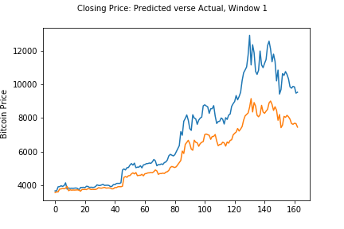
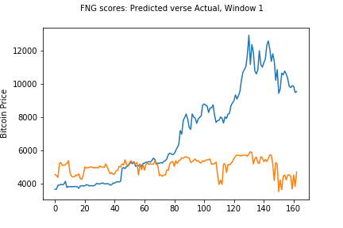
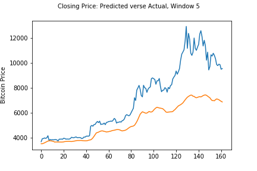
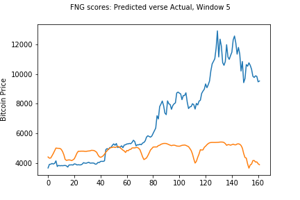
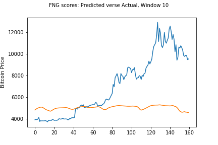

# Deep Learning: LSTM Cryptocurrency Price Predictor

*Does sentiment or closing prices provide a better signal for cryptocurrency price movements?* 

In this analysis, custom Long-short term memory (LSTM) models were used to predict Bitcoin prices. 

Long Short Term Memory model (LSTM) is a type of deep learning with a Recurrent Neural Network (RNN) architecture. It uses feedback connections to keep track of the dependencies between the elements in the input sequence and looks at the last “n” days (timestep or lag) data to predict how the series progresses. 

For this analysis, sentiment and previous closing prices were used as inputs in the models testing various lags of data to determine if there were potential predictive patterns that could accurately forecast prices. For the sentiment data, the [Crypto Fear and Greed Index (FNG)](https://alternative.me/crypto/fear-and-greed-index/) was used to build the first model. The second model used a lag of Bitcoin closing prices.  

1. [Prepare the data for training and testing](#Prepare-the-date-for-training-and-testing)
2. [Build and train the custom LSTM model](#Build-and-train-the-custom-LSTM-model)
3. [Evaluate the performance of the model](#Evaluate-the-performance-of-the-model)


## Prepare the data for training and testing 

Libraries `numpy` and `tensorflow` were first imported; `Tensorflow` is a computational framework for building machine learning models. 

Once the input data was imported, a function `window_data`, created two NumPy arrays for the features data (X) and target data (y). The function was an efficient way to set up various window periods. 

```
def window_data(df, window, feature_col_number, target_col_number):
    X = []
    y = []
    for i in range(len(df) - window - 1):
        features = df.iloc[i:(i + window), feature_col_number] #ndim = 2
        target = df.iloc[(i + window), target_col_number] #ndim = 1 
        X.append(features)
        y.append(target)
    return np.array(X), np.array(y).reshape(-1, 1) #reshape array to ndim = 2
```
The data was further split into 70% training and 30% test and scaled between 0 and 1 using `MinMaxScaler()` from the `sklearn` library.<br/>
<br/>
The freature data, X_train and X_test, were reshaped from two-dimensional to a three-dimensional array.<br/>
The LSTM network reads in three-dimensions for batch size, time-steps, and number of units in one input sequence. 

```
X_train = X_train.reshape((X_train.shape[0], X_train.shape[1], 1))
X_test = X_test.reshape((X_test.shape[0], X_test.shape[1],1))
```

## Build and train the custom LSTM model 

 To build the models, `Sequential`, `LSTM`, `Dense`, and `Dropout` were imported from `tensorflow.keras.models` 
 
`Dropout` is a regularization method where it randomly selects nodes and removes them from activation while training a network to reduce overfitting and improve model performance. A dropout rate of 20% was selected for the models. 

```
model = Sequential()
number_units = 30
dropout_fraction = 0.2
```
<br/>
The models were built with three layers and compiled with the Adam optimizer and mean-squared-error loss function. The models were fit with X_train and y_train, 10 epochs, and 1 batch size.<br/>


```
# Layer 1 
model.add(LSTM(units=number_units, return_sequences=True, input_shape=(X_train.shape[1],1)))
model.add(Dropout(dropout_fraction))

# Layer 2 
model.add(LSTM(units=number_units, return_sequences=True))
model.add(Dropout(dropout_fraction))

# Layer 3
model.add(LSTM(units=number_units))
model.add(Dropout(dropout_fraction))

# Output layer
model.add(Dense(1))

```

## Evaluate the performance of the model 

Once the models were built, X_test data was used to predict prices.  

`predicted = model.predict(X_test)`

Since the original values were scaled, the`inverse_transform()` method was used to decode the scaled values back to their original scale.

```
predicted_prices = scaler.inverse_transform(predicted)
real_prices = scaler.inverse_transform(y_test.reshape(-1,1))
```

### Summary of Model Results 

The models were tested on three windows of data:  1 day, 5 days, and 10 days. 

Sentiment was a poor predictor of Bitcoin prices across all three windows of data, therefore, short-term clusters of sentiment does not appear to be a helpful signal in determining Bitcoin's price.  

Closing prices had a lower loss and tracked closer to actual bitcoin prices over time which may indicate autocorrelation and momentum factors should also potentially be explored. 

Both models predictability weakened as the lag increased.  

| Window | Closing Loss | FNG Loss    |
|:---:     | :---:     | :---:    |
| 1      |0.0271   | 0.1142 |
| 5      | 0.0522  | 0.1227 |
| 10     | 0.0527  | 0.1185 |


| Closing                         | FNG                         |
|:---:                            | :---:                       |
| |     |
| |     |
||   |


